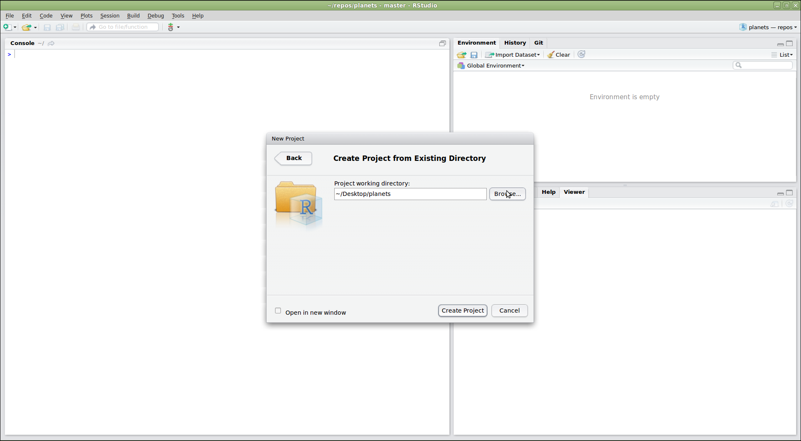
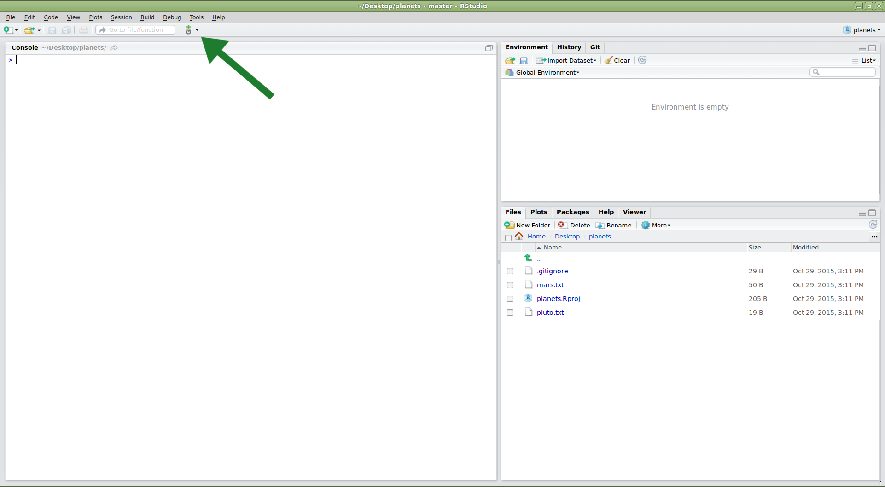
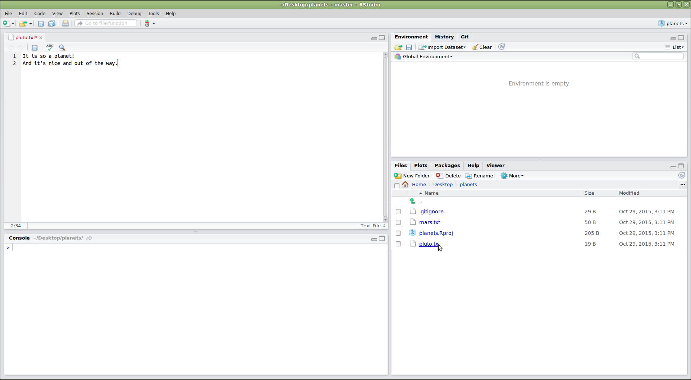
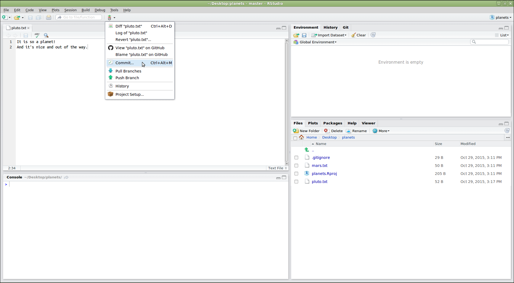
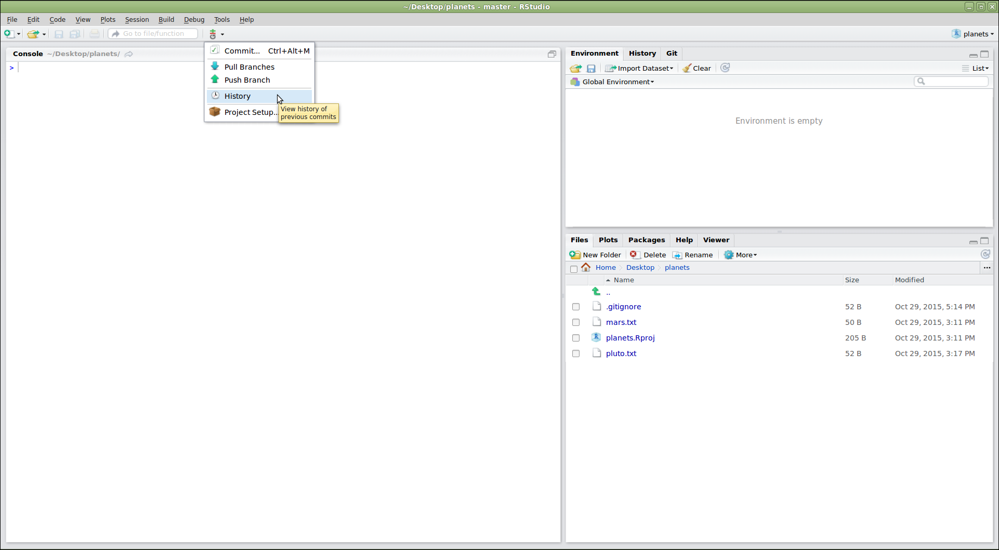

## Introduction

The scientific process is naturally incremental, and many projects
start life as random notes, some code, then a manuscript, and
eventually everything is a bit mixed together.

Most people tend to organize their projects like this:

There are many reasons why we should *ALWAYS* avoid this:

1. It is really hard to tell which version of your data is
the original and which is the modified;
2. It gets really messy because it mixes files with various
extensions together;
3. It probably takes you a lot of time to actually find
things, and relate the correct figures to the exact code
that has been used to generate it;

A good project layout will ultimately make your life easier:

* It will help ensure the integrity of your data;
* It makes it simpler to share your code with someone else
(a lab-mate, collaborator, or supervisor);
* It allows you to easily upload your code with your manuscript submission;
* It makes it easier to pick the project back up after a break.

## A possible solution

Fortunately, there are tools and packages which can help you manage your work effectively.

One of the most powerful and useful aspects of RStudio is its project management
functionality. We'll be using this today to create a self-contained, reproducible
project.

## Challenge: Creating a self-contained project

We're going to create a new project in RStudio:
1. Click the "File" menu button, then "New Project".
2. Click "New Directory".
3. Click "New Project".
4. Type in the name of the directory to store your project, e.g. "my_project".
5. If available, select the checkbox for "Create a git repository."
6. Click the "Create Project" button.

Now when we start R in this project directory, or open this project with RStudio,
all of our work on this project will be entirely self-contained in this directory.

## Best practices for project organization

Although there is no "best" way to lay out a project, there are some general
principles to adhere to that will make project management easier:

### Treat data as read only

This is probably the most important goal of setting up a project. Data is
typically time consuming and/or expensive to collect. Working with them
interactively (e.g., in Excel) where they can be modified means you are never
sure of where the data came from, or how it has been modified since collection.
It is therefore a good idea to treat your data as "read-only".

### Data Cleaning

In many cases your data will be "dirty": it will need significant preprocessing
to get into a format R (or any other programming language) will find useful. This
task is sometimes called "data munging". I find it useful to store these scripts
in a separate folder, and create a second "read-only" data folder to hold the
"cleaned" data sets.

### Treat generated output as disposable

Anything generated by your scripts should be treated as disposable: it should
all be able to be regenerated from your scripts.

There are lots of different ways to manage this output. I find it useful to
have an output folder with different sub-directories for each separate
analysis. This makes it easier later, as many of my analyses are exploratory
and don't end up being used in the final project, and some of the analyses
get shared between projects.

> ## Tip: Good Enough Practices for Scientific Computing
>
> [Good Enough Practices for Scientific Computing](https://github.com/swcarpentry/good-enough-practices-in-scientific-computing/blob/gh-pages/good-enough-practices-for-scientific-computing.pdf) gives the following recommendations for project organization:
>
> 1. Put each project in its own directory, which is named after the project.
> 2. Put text documents associated with the project in the `doc` directory.
> 3. Put raw data and metadata in the `data` directory, and files generated during cleanup and analysis in a `results` directory.
> 4. Put source for the project's scripts and programs in the `src` directory, and programs brought in from elsewhere or compiled locally in the `bin` directory.
> 5. Name all files to reflect their content or function.

### Save the data in the data directory

Now we have a good directory structure we will now place/save the data file in the `data/` directory.

> ## Tip: .RData
>
> You can avoid saving and restoring .RData file using  **Tools -> Glocal Options -> Workspace** menu items.

### Version Control

[RStudio][rstudio]  has built-in
integration with Git. While some advanced Git features still require the
command-line, RStudio has a nice interface for many common Git operations. Let's take our planets directory and turn it into a RStudio project.

To get started using Git in RStudio, we create a new project:

This will open a dialog asking us how we want to create the project. We have
some options here. Let's say that we want to use RStudio with the planets
repository that we already made. Since that repository lives in a directory on
our computer, we choose the option "Existing Directory":

Next, RStudio will ask which existing directory we want to use. Click
"Browse..." and navigate to the correct directory, then click "Create Project":

Ta-da! We have created a new project in RStudio within the existing planets
repository. Notice the vertical "Git" menu in the menu bar. RStudio has
recognized that the current directory is a Git repository, and gives us a
number of tools to use Git:

To edit the existing files in the repository, we can click on them in the
"Files" panel on the lower right. Now let's add some additional information
about Pluto:

Once we have saved our edited files, we can use RStudio to commit the changes
by clicking on "Commit..." in the Git menu:

This will open a dialogue where we can select which files to commit (by
checking the appropriate boxes in the "Staged" column), and enter a commit
message (in the upper right panel). The icons in the "Status" column indicate
the current status of each file. Clicking on a file shows information about
changes in the lower panel (using output of `git diff`). Once everything is the
way we want it, we click "Commit":

The changes can be pushed by selecting "Push Branch" from the Git menu. There
are also options to pull from the remote repository, and to view the commit
history:

> ## Are the Push/Pull Commands Grayed Out?
>
> Grayed out Push/Pull commands generally mean that RStudio doesn't know the
> location of your remote repository (e.g. on GitHub). To fix this, open a
> terminal to the repository and enter the command: `git push -u origin
> master`. Then restart RStudio.

> ## Tip: command line in R Studio
>
> You can quickly open up a shell in RStudio using the **Tools -> Shell...** menu item.

RStudio creates a number of files that it uses to keep track of a project. We
often don't want to track these, in which case we add them to our `.gitignore`
file:

[rstudio]: https://www.rstudio.com/
[rstudio-projects]: https://support.rstudio.com/hc/en-us/articles/200526207-Using-Projects
